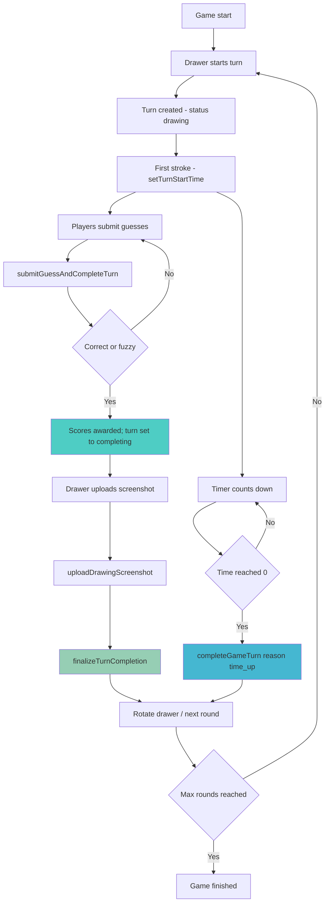

# Turn Management System (Convex)

## Table of Contents

1. [Current System Overview](#current-system-overview)
2. [Convex Data Model](#convex-data-model)
3. [Turn Flow](#turn-flow)
4. [Scoring](#scoring)
5. [State & Concurrency](#state--concurrency)
6. [Issues & Improvements](#issues--improvements)
7. [Roadmap Notes](#roadmap-notes)

## Current System Overview

The game now uses Convex for all real-time state, storage, and atomic operations. Turn management is fully server-driven via Convex mutations, ensuring consistency without client-side races. The system handles three completion scenarios atomically:

1. Correct guess → Guesser and drawer earn points; turn moves to completing/completed
2. Manual winner → Host or drawer selects winner; points awarded accordingly
3. Time up → No winner; turn ends and advances

### Key Components

- Frontend: [components/game/game-board.tsx](components/game/game-board.tsx) orchestrates UI with Convex hooks
- Mutations: [convex/mutations/game.ts](convex/mutations/game.ts) for turns, guesses, rotation
- Drawings: [convex/mutations/drawings.ts](convex/mutations/drawings.ts) for stroke saving; [convex/actions/uploadDrawing.ts](convex/actions/uploadDrawing.ts) for screenshots
- Schema: [convex/schema.ts](convex/schema.ts) tables for `games`, `players`, `cards`, `turns`, `guesses`, `drawings`
- Queries: [convex/queries/games.ts](convex/queries/games.ts) and others for live data

No Supabase or SQL is used. All data integrity is enforced via Convex validators and single-writer mutations.

## Convex Data Model

High-level tables (see full definitions in [convex/schema.ts](convex/schema.ts)):

- games: code, status (`waiting` | `started` | `finished`), category, `created_by`, `current_drawer_id`, `current_card_id`, `round`, `max_rounds`, timestamps
- players: `game_id`, `player_id`, `username`, `avatar_url?`, `score`, `correct_guesses`, `is_host`, `joined_at`
- cards: `game_id`, `word`, `description`, `category`, `is_used`, `created_at`
- turns: `game_id`, `round`, `drawer_id`, `card_id`, status (`drawing` | `completing` | `completed` | `time_up`), `time_limit`, `started_at?`, `completed_at?`, `correct_guesses`, `winner_id?`, `points_awarded?`, `drawer_points_awarded?`
- guesses: `game_id`, `turn_id`, `player_id`, `guess_text`, `is_correct`, `is_fuzzy_match`, `submitted_at`
- drawings: `game_id`, `card_id`, `drawer_id`, `turn_id`, `canvas_data` (normalized strokes), `drawing_file_id?`, `created_at`

Key indexes support real-time queries and rotation: `players.by_game_and_player`, `cards.by_game_and_unused`, `turns.by_game_and_round`, etc.

## Turn Flow

### Primary Mutations & Actions

- start turn: `api.mutations.game.startNewTurn`
- begin timer on first stroke: `api.mutations.game.setTurnStartTime`
- save strokes: `api.mutations.drawings.saveTurnStrokes`
- submit guess (atomic scoring): `api.mutations.game.submitGuessAndCompleteTurn`
- manual/time-up completion: `api.mutations.game.completeGameTurn`
- upload drawing screenshot: `api.actions.uploadDrawing.uploadDrawingScreenshot`
- finalize after upload (advance/finish): `api.mutations.game.finalizeTurnCompletion`

### Flow Diagram (Convex)

### Scenarios

#### 1) Correct Guess (or fuzzy match)

- Guesser calls `submitGuessAndCompleteTurn` with `guess_text` (+ optional `isValidated` from client fuzzy check)
- Server records guess, validates timing, and awards points:
  - Guesser: `timeLeft`
  - Drawer: `max(10, floor(timeLeft/4))`
- Turn is set to `completing`, winner fields populated; further guesses no-op
- Drawer uploads screenshot via `uploadDrawingScreenshot`, then calls `finalizeTurnCompletion` to mark `completed` and rotate

#### 2) Manual Winner

- Host or drawer invokes `completeGameTurn` with `reason="manual"` and `winner_id`
- Server inserts a synthetic correct guess for history, awards points (same formula), marks `completed`, then rotates/advances round

#### 3) Time Up

- Timer reaches limit; host/drawer invokes `completeGameTurn` with `reason="time_up"`
- No points awarded; status becomes `time_up`; rotate/advance logic runs

## Scoring

- Guesser points: `timeLeft` seconds (full time bonus)
- Drawer points: `max(10, floor(timeLeft/4))` (25% + minimum 10)
- Time up: `0` points
- Scores and turn summary (`winner_id`, `points_awarded`, `drawer_points_awarded`) are persisted on the turn and player rows atomically

## State & Concurrency

- Turn status lifecycle: `drawing` → `completing` → `completed | time_up`
- Timer start is draw-triggered via `setTurnStartTime` (first stroke), preventing idle countdowns
- Mutations guard against races by checking status and patching to `completing` before awarding/rotating
- Permission checks (e.g., `canGuess`) enforce roles: drawer cannot guess; only host/drawer can force-complete
- Real-time comes from Convex queries/subscriptions; no manual channels needed

Frontend state suggestions (high-level):

- `isDrawer`, `timeRemaining`, `turnStatus`, `isUploading`, `isFinalizing`
- Pause countdown during manual winner selection in UI; server still enforces authoritative time

## Issues & Improvements

### Resolved

- Race conditions on multiple correct guesses → prevented by status transitions and single mutation path
- Partial failures → avoided by keeping scoring and state changes in one mutation per path
- Drawer screenshot consistency → handled via action + internal mutation to persist storage id

### Opportunities

- UX: richer loading/progress while `completing` and during screenshot upload/finalize
- Performance: minimize re-renders by scoping Convex subscriptions in [components/game/game-board.tsx](components/game/game-board.tsx)
- Features: difficulty multipliers, streak bonuses, achievements, and better guess fuzzy-matching

## Roadmap Notes

- Schema extensions should be added in [convex/schema.ts](convex/schema.ts) via `defineTable` changes and new indexes
- Prefer new mutations for additive features (e.g., awarding streaks) rather than widening existing mutation responsibilities
- Keep timer authority on server: validate elapsed time in mutations with small tolerance for client/server skew

This Convex-based flow is production-ready: consistent scoring, auditable turns with drawings, and reliable rotation across rounds, all powered by real-time Convex subscriptions.
