# Turn Management System Analysis & Improvement Plan

## Table of Contents

1. [Current System Overview](#current-system-overview)
2. [Database Schema](#database-schema)
3. [Turn Flow Documentation](#turn-flow-documentation)
4. [Scoring System](#scoring-system)
5. [State Management](#state-management)
6. [Issues & Pain Points](#issues--pain-points)
7. [Improvement Suggestions](#improvement-suggestions)
8. [Implementation Roadmap](#implementation-roadmap)

## Current System Overview

The Pictionary game implements an **atomic turn-based system** with real-time score tracking and drawing capture. The system uses database-level atomic operations to prevent race conditions and ensure data consistency. It handles three main scenarios for turn completion:

1. **Atomic Correct Guess** - Player guesses correctly, atomic DB function handles everything
2. **Atomic Manual Winner** - Drawer manually selects winner, atomic DB function executes
3. **Atomic Time Up** - Timer expires, atomic DB function processes with no points

### Key Components

- **Frontend**: [`components/game/game-board.tsx`](components/game/game-board.tsx) - Main game interface with real-time subscriptions
- **Atomic Functions**: [`lib/supabase/supabase-guess-and-turns.ts`](lib/supabase/supabase-guess-and-turns.ts) - Client-side atomic operation wrappers
- **Database Functions**: [`setup.sql`](setup.sql) - Server-side atomic transaction functions
- **Player Management**: [`lib/supabase/supabase-players.ts`](lib/supabase/supabase-players.ts) - Player data operations
- **Turn Records**: [`lib/supabase/supabase-turns.ts`](lib/supabase/supabase-turns.ts) - Historical turn tracking

## Database Schema

### Core Tables

```sql
-- Games table stores current game state
games {
  id: UUID PRIMARY KEY
  current_drawer_id: UUID → profiles(id)
  current_card_id: UUID → cards(id)
  timer_end: TIMESTAMP WITH TIME ZONE
  timer: INTEGER (default 120 seconds)
  status: TEXT ('waiting' | 'active' | 'completed')
}

-- Players table tracks scores and turn order
players {
  id: UUID PRIMARY KEY
  player_id: UUID → profiles(id)  -- References user profile
  game_id: UUID → games(id)
  score: INTEGER (default 0)
  order_index: INTEGER
}

-- Turns table records completed rounds (enhanced)
turns {
  id: UUID PRIMARY KEY
  game_id: UUID → games(id)
  card_id: UUID → cards(id)
  drawer_id: UUID → profiles(id)
  winner_id: UUID → profiles(id) (nullable)
  points_awarded: INTEGER          -- Winner points
  drawer_points_awarded: INTEGER   -- Drawer points (25% + min 10)
  turn_number: INTEGER
  drawing_image_url: TEXT
  completed_at: TIMESTAMP
}

-- Guesses table stores all player attempts
guesses {
  id: UUID PRIMARY KEY
  game_id: UUID → games(id)
  player_id: UUID → profiles(id)  -- Direct profile reference
  guess_text: TEXT
  is_correct: BOOLEAN
}
```

### Atomic Database Functions

```sql
-- Atomic turn completion with correct guess
complete_turn_with_correct_guess(
  p_game_id UUID,
  p_guesser_id UUID,     -- Profile ID
  p_guess_text TEXT,
  p_time_remaining INTEGER,
  p_drawing_image_url TEXT
) RETURNS atomic_turn_result

-- Atomic turn completion on time up
complete_turn_time_up(
  p_game_id UUID,
  p_drawing_image_url TEXT
) RETURNS atomic_turn_result

-- Atomic turn completion with manual winner
complete_turn_manual_winner(
  p_game_id UUID,
  p_winner_id UUID,      -- Profile ID
  p_time_remaining INTEGER,
  p_drawing_image_url TEXT
) RETURNS atomic_turn_result
```

## Turn Flow Documentation

### Current Flow Diagram (Atomic System)

```mermaid
graph TD
    A[Game Start] --> B[Drawer Sees Card]
    B --> C[Drawer Clicks 'Start Turn']
    C --> D{Timer Starts}

    D --> E[Players Submit Guesses]
    D --> F[Timer Counts Down]

    E --> G[submitGuess: Insert & Validate]
    G --> H{Guess Correct?}
    H -->|Yes| I[Real-time Subscription Triggers]
    H -->|No| E

    I --> J[Drawer: handleCorrectGuess]
    J --> K[Capture Drawing Image]
    K --> L[Call Atomic DB Function]

    F --> M{Timer = 0?}
    M -->|Yes| N[Drawer: handleTimeUp]
    M -->|No| F

    N --> O[Capture Drawing Image]
    O --> P[Call Atomic DB Function]

    L --> Q[🔒 ATOMIC TRANSACTION]
    P --> Q

    Q --> R[Update Both Player Scores]
    R --> S[Create Turn Record]
    S --> T[Mark Card as Used]
    T --> U[Select Next Drawer]
    U --> V[Get Next Card]
    V --> W{More Cards?}
    W -->|Yes| X[Setup Next Turn]
    W -->|No| Y[Game Complete]

    X --> B

    style Q fill:#FF6B6B
    style L fill:#4ECDC4
    style P fill:#45B7D1
    style I fill:#96CEB4
```



### Detailed Scenarios

#### 1. Atomic Correct Guess Flow

**Trigger**: Real-time subscription detects correct guess
**Location**: [`game-board.tsx:293-325`](components/game/game-board.tsx:293)

```typescript
// Atomic sequence of events:
1. Guesser calls submitGuess(gameId, playerId, guess, timeRemaining)
   - Validates guess against card.title
   - Inserts guess record with is_correct=true
2. Real-time subscription triggers on drawer client
3. Drawer calls handleCorrectGuess(guesser, guessText)
   - Captures drawing image via captureDrawing()
   - Calls completeCorrectGuessTurn() atomic function
4. Database atomic transaction:
   - Validates guess correctness again
   - Updates guesser score: +timeRemaining points
   - Updates drawer score: +max(10, timeRemaining/4) points
   - Creates turn record with both point amounts
   - Marks card as used
   - Selects next drawer (round-robin)
   - Gets next unused card or completes game
5. Real-time updates propagate to all clients
```

#### 2. Atomic Manual Winner Selection

**Trigger**: Drawer clicks "Seleziona Vincitore" button
**Location**: [`game-board.tsx:386-419`](components/game/game-board.tsx:386)

```typescript
// Atomic sequence of events:
1. Drawer opens SelectWinnerModal (timer pauses)
2. Drawer selects winner from eligible players
3. handleSelectWinner(winner) called
   - Captures drawing image
   - Calls completeManualWinnerTurn() atomic function
4. Database atomic transaction:
   - Validates winner is not the drawer
   - Updates winner score: +timeRemaining points
   - Updates drawer score: +max(10, timeRemaining/4) points
   - Creates turn record with manual selection
   - Advances to next turn atomically
5. Modal closes, game continues with new turn
```

#### 3. Atomic Time Up Scenario

**Trigger**: Timer countdown reaches 0
**Location**: [`game-board.tsx:133-163`](components/game/game-board.tsx:133)

```typescript
// Atomic sequence of events:
1. Timer interval detects timeRemaining <= 0
2. "Time Up" modal displayed with correct answer
3. If user is drawer: handleTimeUp() called automatically
   - Captures drawing image
   - Calls completeTimeUpTurn() atomic function
4. Database atomic transaction:
   - Creates turn record with winner_id = null
   - Awards 0 points to all players
   - Marks card as used
   - Advances to next turn
5. Game continues with new drawer/card
```

## Scoring System

### Point Calculation (Enhanced)

- **Guesser Points**: `timeRemaining` seconds as points (full time bonus)
- **Drawer Points**: `max(10, timeRemaining / 4)` points (25% + minimum 10)
- **Time Up**: `0` points for both guesser and drawer
- **Maximum Guesser Points**: Equal to timer duration (default 120)
- **Maximum Drawer Points**: Equal to timer duration / 4 (default 30)

### Atomic Score Update Process

```typescript
// Database-level atomic operations:
1. Lock game row to prevent concurrent modifications
2. Validate game state (drawer, card, etc.)
3. Calculate points for both guesser and drawer
4. Update both player scores in single transaction
5. Create turn record with both point amounts
6. Advance game state (next drawer, next card)
7. Return success with new scores
```

### Score Persistence

- **Atomic Updates**: Both guesser and drawer scores updated in single transaction
- **Historical**: Records both `points_awarded` and `drawer_points_awarded`
- **Real-time**: Updates propagate via Supabase real-time subscriptions
- **Leaderboard**: Aggregates from `players.score` across all games
- **Audit Trail**: Complete turn history with point breakdown

## State Management

### Game State Variables

```typescript
interface GameState {
  currentCard: CardType | null; // Card being drawn
  isDrawer: boolean; // Current user's role
  turnStarted: boolean; // Timer active
  turnEnded: boolean; // Prevent race conditions
  timeRemaining: number; // Countdown value
  isStartingTurn: boolean; // UI loading state
}

interface ModalState {
  showSelectWinner: boolean; // Manual selection UI
  showTimeUp: boolean; // Time expired UI
  correctAnswer: string | null; // Display answer
  isTimerPaused: boolean; // Pause during selection
}
```

### Race Condition Prevention

1. **`turnEnded` Flag**: Prevents multiple next turn calls
2. **Loading States**: Prevents duplicate button clicks
3. **Real-time Subscriptions**: Handle concurrent operations
4. **Timer Pausing**: Stops countdown during manual selection

## Issues & Pain Points

### Previous Limitations (Now Resolved)

1. **✅ Race Conditions - FIXED**

   - ~~Multiple correct guesses could trigger duplicate turn advances~~
   - **Solution**: Atomic database functions with row locking prevent concurrent modifications
   - ~~Timer and manual selection can conflict~~
   - **Solution**: Single atomic transaction handles all turn state changes

2. **✅ Error Handling - IMPROVED**

   - ~~Limited retry logic for failed operations~~
   - **Solution**: Database-level error handling with proper rollback
   - ~~No rollback mechanism for partial failures~~
   - **Solution**: Atomic transactions ensure all-or-nothing operations
   - ~~Network issues can leave game in inconsistent state~~
   - **Solution**: Server-side validation and state consistency

3. **✅ Scoring Issues - ENHANCED**
   - ~~Scoring only based on time remaining~~
   - **Solution**: Dual scoring system (guesser + drawer points)
   - **Enhanced**: Drawer gets 25% of time + minimum 10 points
   - **Better**: Both scores updated atomically

### Current Limitations

1. **User Experience**

   - Limited visual feedback during turn transitions
   - No progress indicators for atomic operations
   - Could benefit from better loading states

2. **Advanced Features**

   - No difficulty-based scoring multipliers
   - No streak bonuses or achievements
   - No AI-powered drawing analysis

3. **Performance Optimization**
   - Real-time subscriptions could be more targeted
   - Drawing upload could be optimized
   - Caching opportunities for card data

## Improvement Suggestions

### 1. Enhanced Race Condition Handling

```typescript
// Add turn state machine
enum TurnState {
  WAITING = "waiting",
  ACTIVE = "active",
  ENDING = "ending",
  COMPLETED = "completed",
}

// Add optimistic locking
interface TurnLock {
  gameId: string;
  turnNumber: number;
  lockId: string;
  expiresAt: Date;
}
```

### 2. Improved Scoring System

```typescript
interface ScoringConfig {
  basePoints: number; // Base points for correct guess
  timeBonus: number; // Multiplier for time remaining
  streakBonus: number; // Bonus for consecutive correct guesses
  difficultyMultiplier: number; // Based on card difficulty
  creativityBonus?: number; // AI-analyzed drawing quality
}

// Example: basePoints + (timeRemaining * timeBonus) + streakBonus
```

### 3. Enhanced Error Recovery

```typescript
interface TurnTransaction {
  id: string;
  gameId: string;
  operations: Array<{
    type: "UPDATE_SCORE" | "CREATE_TURN" | "UPLOAD_DRAWING";
    data: any;
    completed: boolean;
    rollback?: () => Promise<void>;
  }>;
}

// Implement transaction-like behavior for turn completion
```

### 4. Real-time Optimizations

```typescript
// Channel-based updates instead of polling
interface GameChannels {
  gameState: `game:${gameId}:state`;
  guesses: `game:${gameId}:guesses`;
  timer: `game:${gameId}:timer`;
  drawer: `game:${gameId}:drawer`;
}

// Reduce subscription overhead
```

### 5. Advanced Timer Features

```typescript
interface TimerConfig {
  duration: number;
  pausable: boolean;
  extensible: boolean;
  warningThresholds: number[]; // [30, 10, 5] seconds
  autoExtendOnCorrectGuess?: number;
}
```

### 6. Turn Analytics

```typescript
interface TurnAnalytics {
  turnId: string;
  startTime: Date;
  endTime: Date;
  guessCount: number;
  averageGuessTime: number;
  correctGuessTime?: number;
  drawingComplexity?: number;
  playerEngagement: Record<string, number>;
}
```

## Implementation Roadmap

### ✅ Phase 1: Atomic System Implementation (COMPLETED)

**Status: COMPLETED** ✅

1. **✅ Atomic Turn Completion**

   - ✅ Implemented database-level atomic functions
   - ✅ Added proper transaction handling with rollback
   - ✅ Eliminated race conditions with row locking

2. **✅ Dual Scoring System**

   - ✅ Both guesser and drawer earn points
   - ✅ Atomic score updates prevent inconsistencies
   - ✅ Enhanced turn records with complete point breakdown

3. **✅ Drawing Image Preservation**
   - ✅ Proper drawing capture by drawer
   - ✅ Image upload integrated with atomic operations
   - ✅ Complete visual history of turns

### Phase 2: Scoring Improvements (2-3 weeks)

**Priority: Medium**

1. **Advanced Scoring Algorithm**

   - Configurable scoring rules
   - Streak tracking
   - Difficulty-based multipliers

2. **Score Validation**

   - Server-side score calculation
   - Anti-cheat measures
   - Score audit trail

3. **Leaderboard Enhancements**
   - Real-time updates
   - Historical rankings
   - Achievement system

### Phase 3: User Experience (3-4 weeks)

**Priority: Medium**

1. **Enhanced Timer Features**

   - Pause/resume functionality
   - Warning notifications
   - Time extension options

2. **Better Feedback Systems**

   - Guess processing indicators
   - Turn transition animations
   - Real-time score updates

3. **Mobile Optimization**
   - Touch-friendly interfaces
   - Responsive timer display
   - Optimized for smaller screens

### Phase 4: Advanced Features (4-5 weeks)

**Priority: Low**

1. **AI-Powered Features**

   - Drawing quality analysis
   - Hint generation system
   - Automatic winner detection

2. **Game Variations**

   - Team-based scoring
   - Multiple drawing modes
   - Custom game rules

3. **Analytics Dashboard**
   - Game performance metrics
   - Player behavior analysis
   - Turn completion statistics

### Technical Implementation Notes

#### Database Migrations Required

```sql
-- Add turn state tracking
ALTER TABLE games ADD COLUMN turn_state TEXT DEFAULT 'waiting';
ALTER TABLE games ADD COLUMN turn_lock_id UUID;
ALTER TABLE games ADD COLUMN turn_lock_expires_at TIMESTAMP WITH TIME ZONE;

-- Enhanced scoring
ALTER TABLE turns ADD COLUMN base_points INTEGER DEFAULT 0;
ALTER TABLE turns ADD COLUMN time_bonus INTEGER DEFAULT 0;
ALTER TABLE turns ADD COLUMN streak_bonus INTEGER DEFAULT 0;
ALTER TABLE turns ADD COLUMN total_points INTEGER DEFAULT 0;

-- Analytics
CREATE TABLE turn_analytics (
  id UUID PRIMARY KEY DEFAULT gen_random_uuid(),
  turn_id UUID REFERENCES turns(id),
  start_time TIMESTAMP WITH TIME ZONE,
  end_time TIMESTAMP WITH TIME ZONE,
  guess_count INTEGER DEFAULT 0,
  drawing_complexity FLOAT,
  player_engagement JSONB,
  created_at TIMESTAMP WITH TIME ZONE DEFAULT NOW()
);
```

#### API Changes Required

```typescript
// Enhanced turn completion
interface NextTurnParams {
  gameId: string;
  cardId: string;
  scoring: {
    winnerId?: string;
    basePoints: number;
    timeBonus: number;
    streakBonus: number;
    totalPoints: number;
  };
  analytics?: TurnAnalytics;
  drawingImageUrl?: string;
}

// Turn state management
interface TurnStateUpdate {
  gameId: string;
  newState: TurnState;
  lockId?: string;
  metadata?: Record<string, any>;
}
```

### Success Metrics

1. **Stability**

   - 99%+ turn completion success rate
   - < 1% duplicate turn issues
   - < 500ms average turn processing time

2. **User Experience**

   - < 2 second turn transition time
   - Real-time score updates
   - Zero data loss incidents

3. **Performance**
   - < 100ms guess submission response
   - < 50KB average payload size
   - Support for 50+ concurrent games

## Conclusion

The turn management system has been **significantly upgraded** with a robust atomic architecture that eliminates previous race conditions and consistency issues. The implementation represents a major improvement in system reliability and user experience.

### ✅ Current Achievements

1. **✅ Atomic Operations**: Database-level transactions ensure data consistency
2. **✅ Dual Scoring**: Both guesser and drawer earn points appropriately
3. **✅ Drawing Preservation**: Complete visual history with proper image capture
4. **✅ Real-time Coordination**: Seamless synchronization between drawer and guessers
5. **✅ Error Resilience**: Proper rollback and error handling mechanisms

### Current System Status: **PRODUCTION READY** 🚀

The atomic turn system provides:

- **Zero race conditions** with database row locking
- **Consistent scoring** with dual point awards
- **Complete audit trail** with turn history and images
- **Real-time updates** across all connected clients
- **Robust error handling** with automatic rollback

### Future Enhancement Opportunities

1. **User Experience**: Enhanced loading states and transition animations
2. **Advanced Scoring**: Difficulty multipliers and streak bonuses
3. **Performance**: Optimized real-time subscriptions and caching
4. **Analytics**: Game performance metrics and player behavior insights

The system now provides a stable, scalable foundation for future enhancements while delivering a smooth, reliable gaming experience.
